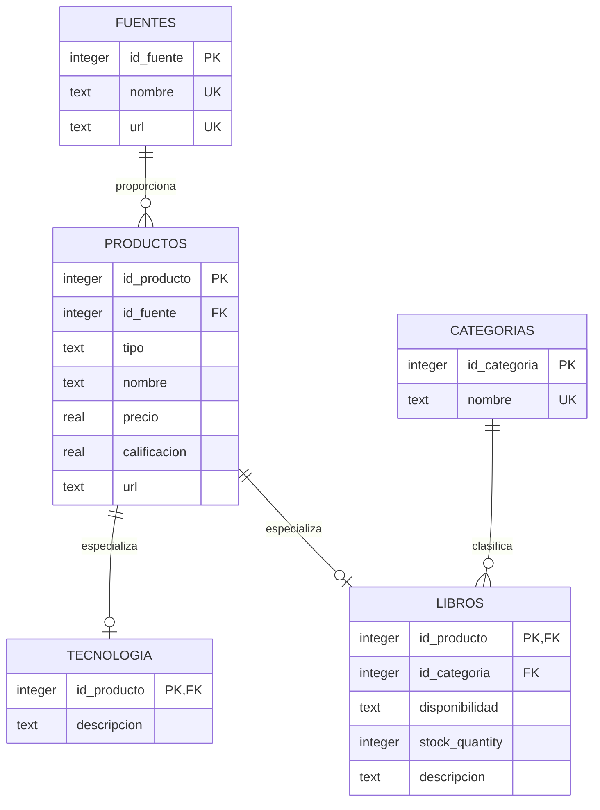

# Laboratorio ETL con Scrapy y SQLite

## 1. Objetivo

Construir un proceso ETL que extraiga información de libros y productos tecnológicos, transforme los datos y los almacene en una base de datos SQLite relacional para realizar consultas analíticas.

## 2. Fuentes exploradas

### Books to Scrape

- URL: https://books.toscrape.com/
- Tipo de información: catálogo de libros.
- Información extraída: título, precio, calificación, URL, categoría, disponibilidad, cantidad disponible y descripción.
- Estructura: catálogo paginado con enlaces a fichas individuales.
- Registros obtenidos: 1.000 libros.
- Problemas considerados: precios y calificaciones inicialmente textuales, espacios innecesarios y valores faltantes.

### Web Scraper Test Sites

- URL: https://webscraper.io/test-sites/e-commerce/allinone/computers/laptops
- Tipo de información: catálogo de laptops.
- Información extraída: nombre, precio, calificación, URL, categoría y descripción.
- Estructura: tarjetas de productos con paginación.
- Registros obtenidos: 117 productos tecnológicos.
- Problemas considerados: nombre y precio se encontraban dentro de atributos y elementos HTML específicos, además de espacios y saltos de línea.

### Información común

Ambas fuentes tienen productos con nombre, precio, calificación y URL. La categoría, descripción y disponibilidad son atributos que pueden variar según la fuente.

## 3. Extracción

La extracción se implementa en `etl/spiders.py` mediante dos spiders Scrapy:

- `BooksSpider`: recorre el catálogo y consulta la ficha de cada libro.
- `LaptopsSpider`: recorre la sección de laptops y extrae las tarjetas de productos.

Comando de ejecución:

```powershell
& .\env\Scripts\python.exe -m etl.run
```

Los datos intermedios se guardan en `etl_output/books_etl.json` y `etl_output/laptops_etl.json`.

## 4. Transformación y limpieza

El módulo `etl/transform.py` realiza las siguientes operaciones:

- Eliminación de espacios y saltos de línea innecesarios.
- Conversión de precios a números decimales.
- Conversión de calificaciones textuales como `Five` a números de 1 a 5.
- Normalización de disponibilidad y extracción de la cantidad disponible.
- Conversión de valores vacíos a `NULL`.
- Validación de precios no negativos.
- Validación de calificaciones entre 1 y 5.
- Eliminación de duplicados usando fuente y URL.
- Validación de campos obligatorios: fuente, tipo, nombre y URL.

## 5. Modelo de base de datos

La base se encuentra en `etl.db` y su definición en `etl/schema.sql`.



Relaciones principales:

- Una fuente proporciona muchos productos.
- Un producto pertenece a una fuente.
- Un producto puede tener información específica de tecnología o de libro.
- Una categoría clasifica muchos libros.
- Cada libro puede pertenecer a una categoría.

## 6. Consultas y resultados

Las consultas completas están en `etl/queries.sql`.

### 1. Producto junto con la fuente

La consulta relaciona `productos` con `fuentes` mediante `id_fuente`.

### 2. Información relacionada con categorías

La consulta relaciona `libros`, `productos` y `categorias` mediante sus claves foráneas.

### 3. Cantidad de productos por tipo

| Tipo | Cantidad |
|---|---:|
| libro | 1.000 |
| tecnologia | 117 |

### 4. Producto más costoso

| Producto | Precio | Fuente |
|---|---:|---|
| Asus ROG Strix SCAR Edition GL503VM-ED115T | 1799.00 | Web Scraper Test Sites |

### 5. Producto más económico

| Producto | Precio | Fuente |
|---|---:|---|
| An Abundance of Katherines | 10.00 | Books to Scrape |

### 6. Precio promedio

**126.65**

### 7. Calificación promedio

**2.86**

### 8. Fuente con más productos

| Fuente | Cantidad |
|---|---:|
| Books to Scrape | 1.000 |

## 7. Validación de la carga

- Productos totales: 1.117.
- Registros en `libros`: 1.000.
- Registros en `tecnologia`: 117.
- URLs duplicadas: 0.
- Productos sin nombre o URL: 0.
- Errores de claves foráneas: 0.

La carga se realiza con SQLite, transacciones y restricciones de integridad. Puede repetirse usando `--skip-extract` sin generar duplicados.

## 8. Archivos de la entrega

- `etl/spiders.py`: extracción Scrapy.
- `etl/transform.py`: transformación y limpieza.
- `etl/database.py`: carga SQLite.
- `etl/schema.sql`: modelo relacional.
- `etl/queries.sql`: consultas solicitadas.
- `etl/run.py`: ejecución del proceso completo.
- `etl.db`: base de datos SQLite.
- `etl_output/`: resultados JSON de extracción.
- `README.md`: instrucciones de ejecución.
